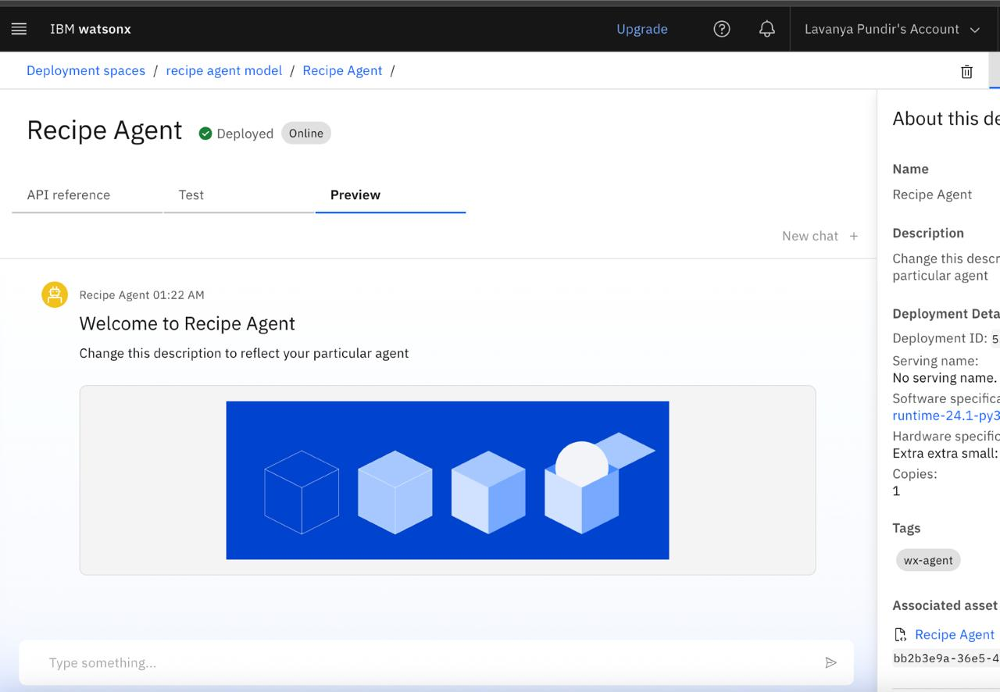
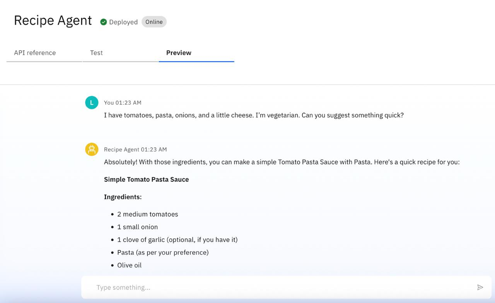
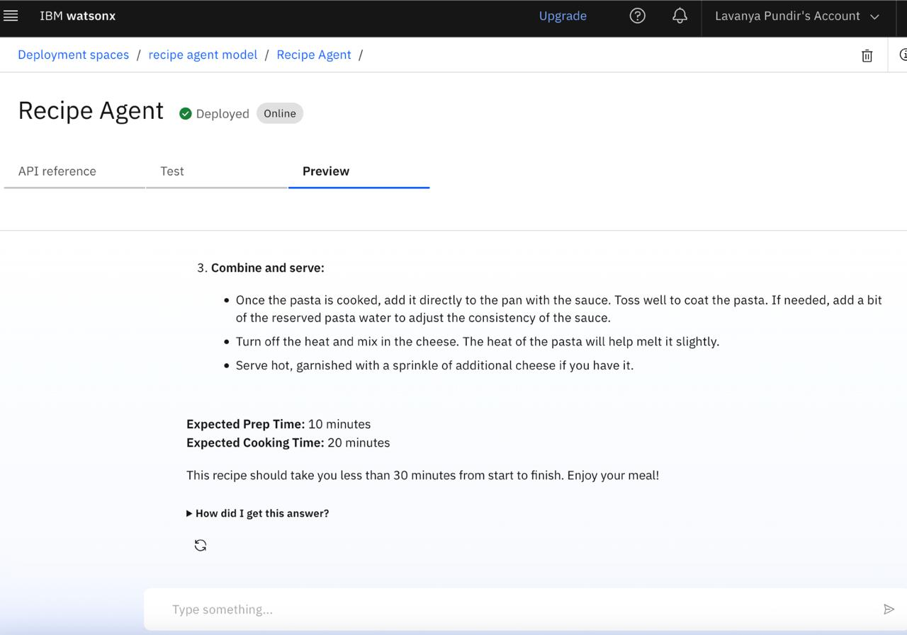

# 🧠 IBM Watsonx AI Deployment

This project integrates IBM Watsonx AI via a secure API to perform intelligent tasks like recipe generation, conversation, and more.

## 🔗 API Endpoint
https://us-south.ml.cloud.ibm.com/ml/v4/deployments/53690cf3-d53e-46a4-970a-db3e3c197889/ai_service_stream?version=2021-05-01

## 🔑 Authentication

- Requires IBM Cloud API Key.
- IAM token is generated using:

## 📌 How to Use

1. Clone this repo
2. Replace `ApiKey-c9ab191f-fd4f-4d02-9743-ad6a73f576f5` in the script
3. Run `code.py`

## 🖼️ Screenshot: Home UI

### 🤖 API Response

.jpg)

