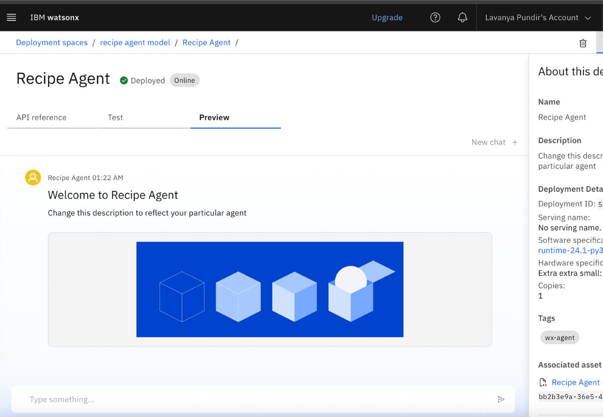
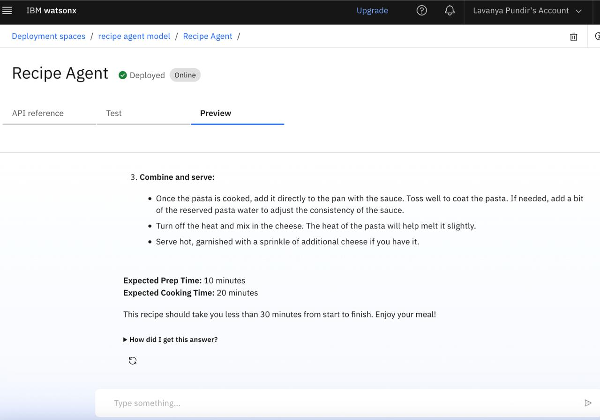
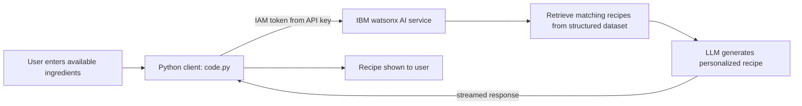

# Recipe Preparation Agent

An AI agent that suggests personalized, adaptive recipes from the limited ingredients you have on hand. It uses **Retrieval-Augmented Generation (RAG)** on **IBM watsonx** and **IBM Cloud Lite**, so answers are grounded in a structured recipe dataset instead of being made up by the model.

Built as part of the AICTE & IBM SkillsBuild internship (Edunet Foundation), July – August 2025.

## Demo

| Home screen | Example response |
|---|---|
|  |  |

More example outputs: [response 2](docs/response-2.jpg) · [response 3](docs/response-3.jpg)

## How it works


```mermaid
flowchart LR
    A[User enters available ingredients] --> B[Python client: code.py]
    B -->|IAM token from API key| C[IBM watsonx AI service]
    C --> D[Retrieve matching recipes from structured dataset]
    D --> E[LLM generates personalized recipe]
    E -->|streamed response| B
    B --> F[Recipe shown to user]
```

1. The user lists the ingredients they have.
2. The client authenticates with IBM Cloud using an IAM token generated from an API key.
3. The deployed watsonx AI service retrieves relevant recipes from the dataset (RAG).
4. The LLM adapts the retrieved recipes to the ingredients available and streams the answer back.

## Tech stack

Python · IBM watsonx · IBM Cloud Lite · Retrieval-Augmented Generation · NLP · Jupyter Notebook

## Setup

1. Clone the repo and install dependencies:
   ```bash
   git clone https://github.com/Lavanya-pundir/Recipe-Agent-.git
   cd Recipe-Agent-
   pip install requests
   ```
2. Create an IBM Cloud account and your own watsonx deployment, then create an API key under **IAM → API keys**.
3. Set your credentials as environment variables. **Never put them in the code or commit them.**
   ```bash
   export IBM_API_KEY="your-api-key"
   export IBM_DEPLOYMENT_URL="your-deployment-endpoint"
   ```
4. Run the agent:
   ```bash
   python code.py
   ```

## Example

**Input:** `tomato, onion, rice, garlic`

**Output:** [paste a short real response from your agent here]

## Results and limits

- [Add one measurable result, e.g. number of recipes in the dataset or how many test ingredient sets you tried]
- Works best when the ingredient list is short and common; rare ingredients return weaker matches.
- Does not check dietary restrictions or allergies yet.

## What I'd improve next

- Add dietary filters (vegetarian, vegan, allergies)
- Evaluate retrieval quality on a set of test ingredient lists
- Deploy a public demo

## Files

| File | Purpose |
|---|---|
| `code.py` | Client that authenticates and calls the watsonx service |
| `recipe agent notebook.ipynb` | Notebook used to build and test the agent |
| `docs/` | Screenshots |

## Author

Lavanya Pundir · [LinkedIn](https://www.linkedin.com/in/lavanya-pundir) · lavanya.pundir2004@gmail.com
